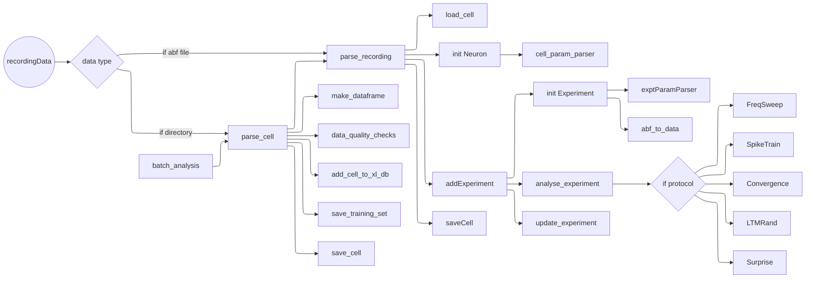

# E-I Dynamics: Analysis Pipeline

Author: Aditya Asopa  
Bhalla Lab, NCBS

## Installation

Required: Python 3.7+

1. Install Python 3.7.x (compatibility issues for later versions with allenSDK and x-to-nwb)

2. make virtual environment

    > python -m venv venv-lab

3. Activate virtual envirionment

    > \venv-lab\scripts\activate

4. Install libraries

    > pip install -r requirements_detailed.txt

5. Register venv-lab kernel in jupyter-lab/ipython

    > python -m ipykernel install --user --name=venv-lab  

-------------  

## Pre-requisites for running the pipeline on a cell

+ Every recorded cell should have its own folder.
+ Inside the folder, every experiment (`exptID`) should have one `exptID_rec.abf` file.
+ Every `.abf` file is accompanied by an `exptID_experiment_parameters.py` file that contains the experiment parameters for that experiment.
+ Coordinates of optical stimulation are contained in a folder called `polygon Protocols`. Each file in this folder is a separate polygon protocol with rows as frames, and columns as frame number, grid size x, grid size y, spot coordinates for that frame. For ex:  
    > 3 24 24 205 251 297 389 447  
    Means, 3rd frame is a grid of 24x24 pixels, and 5 squares at index 205,251...447 are illuminated.
+ An `all_cells.py` file contains a variable called _all_cells_ that is a list of all the folders (i.e. cells).
+ The program is run by executing `batchAnalysis.py`.
  > python batchAnalysis.py -a all_cells.py

-------------  

## Structure of the Pipeline

-------------  

## Examples  

### 1. Analyse all recordings on one cell

+ Have a folder named as `cellID`. for ex. 'CA1PC001'
+ Make sure all the recording files that are going to be part of the cell are named with the suffix `xxxxx_rec.abf`, where xxxx is the experiment ID.
+ Make sure all the recording files also have a corresponding `xxxx_experiment_parameter.py`.
+ The experiment parameter file should follow [this template](/eidynamics/experiment_parameters_default.py)

> python analysis.py /path/to/cell/folder

### 2. To analyse one recording

> python analysis.py /path/to/xxxx_rec.abf

